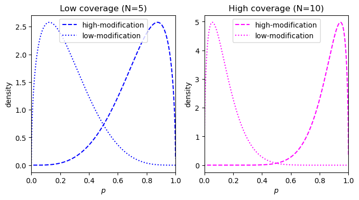
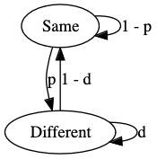
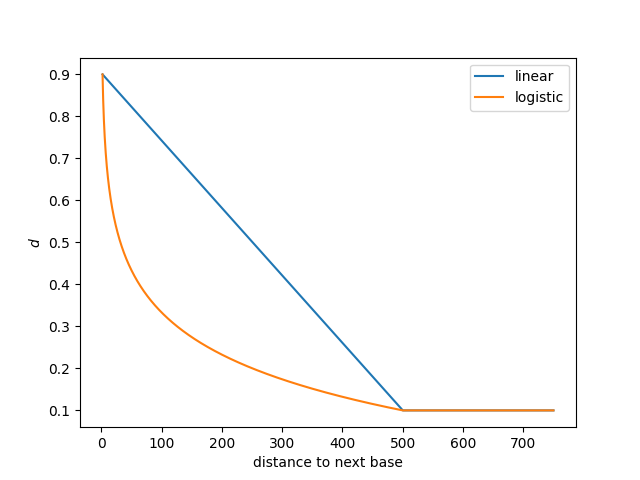

# DMR model and scoring details

## Likelihood ratio scoring details
The aim of `modkit dmr` is to enable exploratory data analysis of methylation patterns. To that aim, the approach to 
scoring methylation differences is intended to be simple and interpretable. For every region provided, within a sample, 
we model each potentially methylated base as arising from the same distribution. In other words, we discard the relative 
ordering of the base modification calls within a region. We then define a model for the frequency of observing each base 
modification state. In the case of methylated versus unmodified (5mC vs C, or 6mA vs A), we use the binomial distribution
and model the probability of methylation \\(p\\) as a beta-distributed random variable: 

\\[
    \mathbf{X}|p \sim \text{Bin}(n, p)
\\]
\\[
    p \sim \text{Beta}(\alpha, \beta)
\\]

where \\(n\\) is the number of potentially methylated bases reported on in the 
region and \\(\mathbf{X}\\) is the vector of counts (canonical and methylated). 

In the case where there are more than two states (for example, 5hmC, 5mC, and unmodified C) we use a multinomial 
distribution and a Dirichlet as the base distribution: 
\\[
    \mathbf{X}|\pi \sim \text{Mult}(n, \pi)
\\]

\\[
    \pi \sim \text{Dir}(\alpha)
\\]

Let \\(\theta\\) be the parameters describing the posterior distribution ( \\( \alpha, \beta \\) for the binary case, 
and \\(\alpha \\) in the general case). The `score` reported is the result of the following log marginal likelihood 
ratio :

\\[
\text{score} = \text{log}(\frac{l_{\theta_{a}}( \mathbf{X_a} ) l_{\theta_{b}} ( \mathbf{X_b} )}{l_{\theta_{a+b}} (\mathbf{X_{a+b}} )})
\\]

Where \\(\theta_a\\) and \\(\theta_b\\) are the posterior distributions with the two conditions modeled separately, 
and \\(\theta_{a+b}\\) is the posterior when the two conditions are modeled together. The function \\(l_{\theta}\(\mathbf{X}) \\) is 
the log marginal likelihood of the counts under the parameters of the model \\(\theta\\).
For all cases, we use [Jeffrey's prior](https://en.wikipedia.org/wiki/Jeffreys_prior) as the prior distribution.

## MAP-based p-value

This metric models the effect size (i.e. the difference) in base modification (of any kind) between two conditions.
For example, if one condition has 8 of 10 reads reporting modification, 80%, and the other condition has 2 of 10, 20%, then the effect size 0.6 or 60%.
This metric only captures changes in modified versus unmodified bases, in other words, changes in modification type will not be captured by this metric. 
See the [limitations](./limitations.md) for details.
The DMR module in modkit uses Bernoulli trials (modified/not-modified) and a prior to calculate a posterior distribution over \\(p\\), the true probability that the site is modified.
The posterior distribution over \\(p\\) given some observations, \\(X\\), is \\(P(p | X)\\), is a Beta distribution.
Where \\(X\\) is the observations (\\(N_{\text{mod}}\\) and \\(N_{\text{canonical}}\\)), the number of reads calling a modified base and a canonical base, respectively.

\\[
    P(p | X) = \text{Beta}(\alpha_0 + N_{\text{mod}}, \beta_0 + N_{\text{can}})
\\]
Where \\(\alpha_0\\) and \\(\beta_0\\) are the parameters for the prior distribution \\(\text{Beta}(\alpha_0, \beta_0)\\).
The advantage to this model is that as you collect more coverage, the variance of the posterior gets smaller - you're more confident that the true value of \\(p\\) is near the empirical mean.
But when you have low coverage, you keep the uncertainty around.

More formally, let \\(\textbf{X}\\) be a Beta-distributed random variable representing the posterior distribution over \\(p\\) for the first condition and \\(\textbf{Y}\\) is the same for the second condition.
Finally, let \\(f(x)\\) be the probability density of the difference \\(x\\) in \\(\textbf{X}\\) and \\(\textbf{Y}\\).
Then the MAP-based p-value, \\(p_{\text{MAP}}\\), is the posterior odds of the effect size being zero (no difference) versus the _maxumum a posteriori_ (MAP) outcome:

\\[
p_{\text{MAP}} = \frac{f(0.0)}{f(x_{\text{MAP}})} \\
\\]
\\[
f(x) = PDF_{\textbf{Z}}(x) \\
\\]
\\[
\textbf{Z} = \textbf{X} - \textbf{Y} \\ 
\\]
\\[
\textbf{X} \sim \text{Beta}(\alpha_1, \beta_1) \\
\\]
\\[
\textbf{Y} \sim \text{Beta}(\alpha_2, \beta_2) \\
\\]

This metric was proposed by [Makowski et al.](https://www.frontiersin.org/articles/10.3389/fpsyg.2019.02767/full) and can be easily visualized.
Consider an example with a true effect size of 0.8 at two coverages, 5 reads and 10 reads.
For an effect size of 0.8, the \\(p\\) for the low modification condition and the high modification condition is 0.1 and 0.9, respectively.
This corresponds to 4 of 5 reads being called methylated in the low-coverage case, and 9 of 10 reads being called modified in the high-coverage condition.
The reciprocal counts are used in both conditions, so 1 of 5 for the low-coverage and 1 of 10 for the high-coverage.
- Low coverage = 5: 4 of 5 modified versus 1 of 5 modified
- High coverage = 10: 9 of 10 modified versus 1 of 10 modified

Starting with a prior of \\(\text{Beta}(0.5, 0.5)\\), we can calculate the posterior density for the two conditions:

What we need to calculate is the probability distribution of the _difference_ (the effect size) between the two conditions (high-modification and low-modification).
This distribution can be done using a piecewise solution described by [Pham-Gia, Turkkan, and Eng in 1993](https://www.tandfonline.com/doi/abs/10.1080/03610929308831114), the distribution is shown below:

The MAP-based p-value is the ratio of the circles over the triangles.
The implementation in `modkit` takes a small short-cut however, and uses the empirical effect size \\(d = \hat{p}_1 - \hat{p}_2\\) instead of the _maximum a posteriori_ outcome.

\\[
\text{p-MAP}^{\prime} = \frac{f(0.0)}{f(d)} \\
\\]

\\[
d = \hat{p}_1 - \hat{p}_2 \\
\\]

\\[
\hat{p} = \frac{ N_{\text{mod}} }{ N_{\text{canonical}} } \\
\\]

## DMR segmentation hidden Markov model

When performing "single-site" analysis with `modkit dmr pair` (by omitting the `--regions` option) you can optionally run the "segmentation" model at the same time by passing the `--segment` option with a filepath to write the segments to. 
The model is a simple 2-state hidden Markov model, shown below, where the two hidden states, "Different" and "Same" indicate that the position is either differentially methylated or not.

The model is run over the intersection of the modified positions in a [pileup](https://nanoporetech.github.io/modkit/intro_bedmethyl.html#description-of-bedmethyl-output) for which there is enough coverage, from one or more samples.

## Transition parameters
There are two transition probability parameters, \\(p\\) and \\(d\\).
The \\(p\\) parameter is the probability of transitioning to the "Different" state, and can be roughly though of as the probability of a given site being differentially modified without any information about the site. 
The \\(d\\) parameter is the maximum probability of remaining in the "Different" state, it is a maximum because the value of \\(d\\) will change dynamically depending on the proximity of the next modified site.
The model proposes that modified bases in close proximity will share modification characteristics. 
Specifically, when a site is differentially modified the probability of the next site also being differentially modified depends on how close the next site happens to be. 
For example, if a CpG dinucleotide is differentially modified and is immediately followed by another CpG (sequence is `CGCG`) we have the maximum expectation that the following site is also differentially modified.
However, as the next site becomes farther away (say the next site is one thousand base pairs away, `CG[N x 1000]CG`) these sites are not likely correlated and the probability of the next site being differentially modified decreases towards \\(p\\).
The chart below shows how the probability of staying in the "Different" state, \\(d\\), decreases as the distance to the next modified base increases.

In this case, the maximum value of \\(d\\) is 0.9, \\(p\\) is 0.1, and the `decay_distance` is 500 base pairs (these also happen to be the defaults).
This can be seen as the maximum value of both curves is 0.9, and the minimum value, reached at 500 base pairs, is 0.1.
These parameters can be set with the `--diff-stay`, `--dmr-prior`, and `--decay-distance`, parameters, respectively.
The two curves represent two different ways of interpolating the decay between the minimum (1) and the `decay_distance`, `linear` and `logistic`.
The `--log-transition-decay` flag will use the orange curve whereas the default is to use the blue curve.

In general, these settings don't need to be adjusted.
However, if you want very fine-grained segmentation, use the `--fine-grained` option which will produce smaller regions but also decrease the rate at which sites are classified as "Different" when they are in fact not different.

## Emission parameters
The emissions of the model are derived from the [likelihood ratio score](https://nanoporetech.github.io/modkit/dmr_scoring_details.html#likelihood-ratio-scoring-details).
One advantage to using this score is that differences in methylation type (i.e. changes from 5hmC to 5mC) will be modeled and detected.
The score is transformed into a probability by \\( p = e^{\text{-score}} \\).
The full description of the emission probabilities for the two states is:

\\[
    p_{\text{Same}} = e^{\text{-score}}
\\]
\\[
    p_{\text{Different}} = 1 - p_{\text{same}}
\\]
