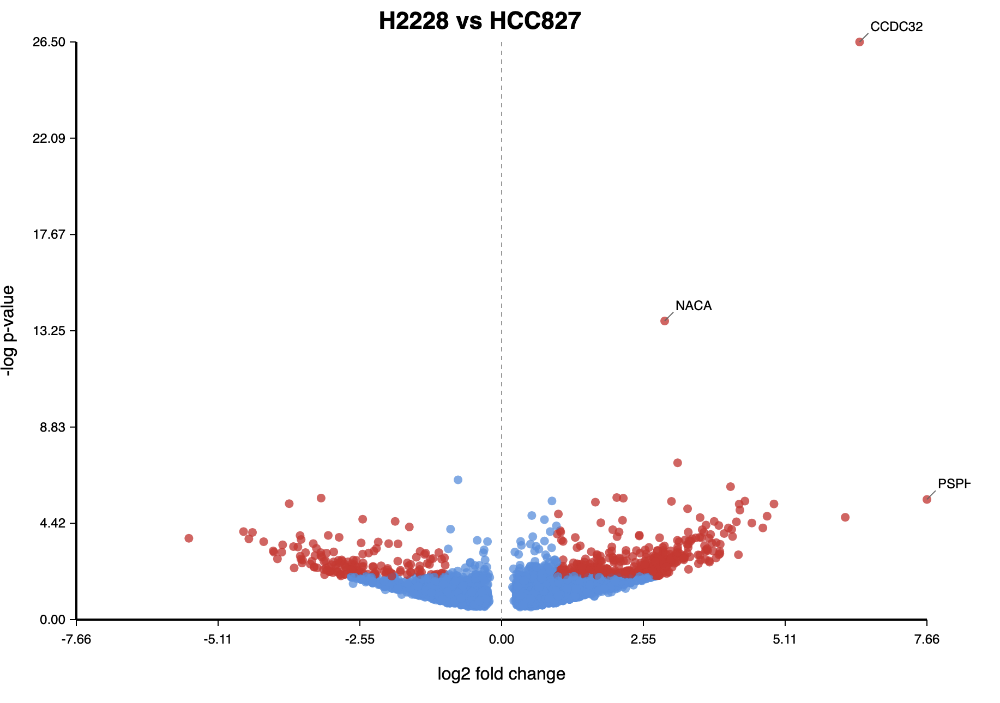

# Compare methylation levels at transcriptome sites, summarized by gene, with `dmr compare-tx-sites`

The `dmr compare-tx-sites` allows you to compare modifications between two conditions.
This command uses a transcriptome-aligned bedMethyl table and maps the coordinates from each transcript to common gene coordinates.
After which, the modification counts from each isoform are combined making a gene-level pileup.
The gene-level modifications are then compared using the same method as `dmr isoform`.

## Example command:

This command uses two bedMethyl tables corresponding to two conditions to be compared.
These bedMethyl tables are expected to be bgzipped and have tabix indices.

```bash
modkit dmr compare-tx-sites \
  -a ${bedmethyl_a} \
  -b ${bedmethyl_b} \
  --out ${output.bed} \
  --gtf ${gtf}
```

A volcano plot can be also made, using the following extra options.
An example is below.

```bash
modkit dmr compare-tx-sites \
  -a ${bedmethyl_a} \
  -b ${bedmethyl_b} \
  --out ${output.bed} \
  --single-mod-code a \
  --plot volcano.svg \
  --gtf ${gtf} \
  --log debug.log
```

The volcano plot requires that `--single-mod-code` is used, since log2 fold-change is essentially a 2-class metric. 



These data were downloaded from the reference [You et al., Benchmarking long-read RNA-sequencing technologies with LongBench: a cross-platform reference dataset profiling cancer cell lines with bulk and single-cell approaches](https://www.biorxiv.org/content/10.1101/2025.09.11.675724v1)

## Schema of output


| column | name                         | description                                                                     | type  |
|--------|------------------------------|---------------------------------------------------------------------------------|-------|
| 1      | chrom                        | name of contig from GTF                                      | str   |
| 2      | chromStart                   | 0-based start position                                                          | int   |
| 3      | chromEnd                     | 0-based exclusive end position                                                  | int   |
| 4      | name | modification codes present at this position                                                  | str   |
| 5      | score | likelihood ration score                                                  | float   |
| 6      | strand | strand, '+' or '-'                                                  | str |
| 7      | p_value | p-value of alternative hypothesis                                                  | float |
| 8      | gene_id | gene-id from the GTF                                                  | str |
| 9      | gene_name | gene-name from the GTF or '-' if not found                                                  | str |
| 10      | log2_fold_change | log base 2 fold change                                                  | float |
| 11      | cond_a_proportions | JSON formatted string of condition 'A' per-modification proprotions                                                  | str |
| 12      | cond_b_proportions | JSON formatted string of condition 'B' per-modification proprotions                                                  | str |
| 13      | cond_a_counts | JSON formatted string of condition 'A' per-modification counts                                                  | str |
| 14      | cond_b_counts | JSON formatted string of condition 'B' per-modification counts                                                  | str |

Columns 11 through 14 are only present when the `--full` flag is passed.


