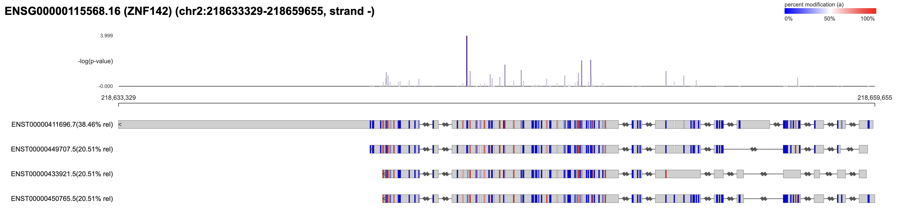
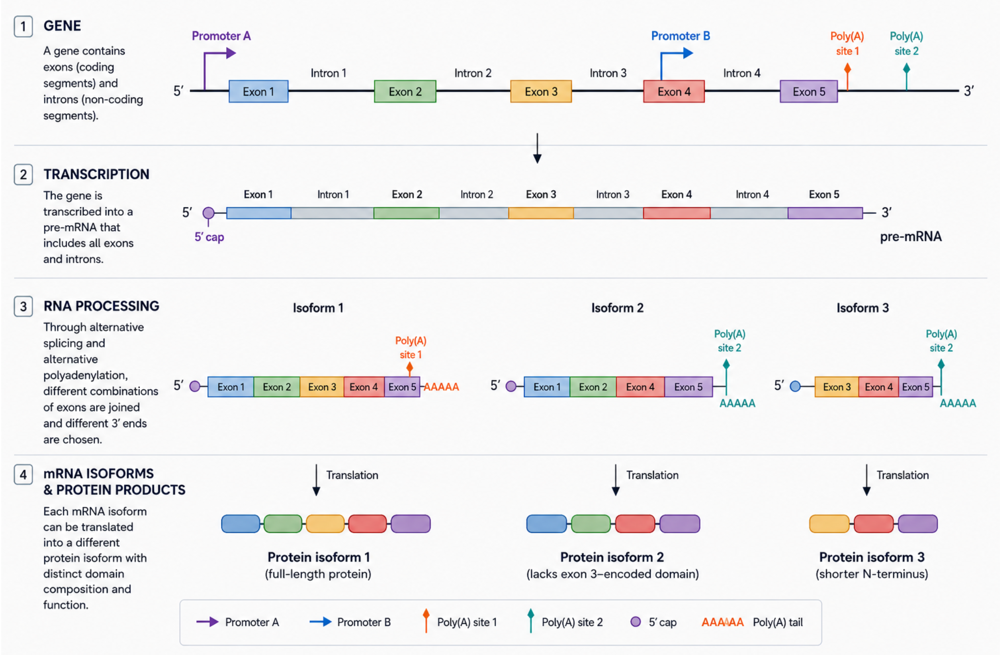

# Find positions varying in modification across isoforms with `dmr isoform`.

This command will compare the modification levels at common exonic positions for all isoforms of a gene.



## Example 
The input to `dmr isoform` is a single bedMethyl table that has been generated from a modBAM of reads aligned to a reference transcriptome (or transcriptome assembly).
This command also requires an accompanying GTF file with valid transcript models.

Below is an example command:

```bash
$ modkit dmr isoform \
  ${bedmethyl} \
  isoform_dmr.bed \
  --gtf ${gtf}
```

The bedMethyl table is expected to be bgzipped and have a tabix index.

To generate an isoform SVG plot like the one above, add the following arguments:

```bash
modkit dmr isoform \
  ${bedmethyl} \
  isoform_dmr_${gene_name}.bed \
  --plot path/to/plot/dir \
  --gene-name ${gene_name} \
  --gtf ${gtf}
```

> **Important:** `--plot` requires either `--gene-name` or `--gene-id` and **cannot** be used
> in whole-transcriptome mode (i.e. without one of those arguments). Attempting to use `--plot`
> without a gene specifier will result in an error.

*Note* that exons without marks in certain transcripts indicates that there is no data in the input bedMethyl. 
The command `modkit bedmethyl map-to-genome` can map a transcript-aligned bedMethyl to genome coordinates.

## Schema of output

| column | name                         | description                                                                     | type  |
|--------|------------------------------|---------------------------------------------------------------------------------|-------|
| 1      | chrom                        | name of contig from GTF                                      | str   |
| 2      | chromStart                   | 0-based start position                                                          | int   |
| 3      | chromEnd                     | 0-based exclusive end position                                                  | int   |
| 4      | name | modification codes present at this position                                                  | str   |
| 5      | score | likelihood ration score                                                  | float   |
| 6      | strand | strand, '+' or '-'                                                  | str |
| 7      | p_value | p-value of alternative hypothesis                                                  | float |
| 8      | max_absolute_difference | largest effect size of all isoforms at this position                                                  | float |
| 9      | n_transcripts | number of transcripts (isoforms) contributing to this position                                                  | int |
| 10      | gene_id | gene-id from the GTF                                                  | str |
| 11      | gene_name | gene-name from the GTF or '-' if not found                                                  | str |
| 12      | pooled_proportions | gene-level aggregate modification rate | str | 
| 13      | per_isoform_proportions | JSON formatted string of per-transcript, per-modification proprotions                                                  | str |
| 14      | per_isoform_counts | JSON formatted string of per-transcript, per-modification counts                                                  | str |

Columns 12 and 14 are only present when the `--full` flag is passed.

## Background 
Gene sequences alone don't describe all of the diversity of mRNAs in vertebrate cells.
Through alternative splicing gene exons can be combined in multiple permutations called isoforms.




## Filtering the number of methylation marks
Some long genes may have many modified positions and drawing them all can get crowded.
To only plot positions with a maximum p-value or minimum score use the `--max-pval` or
`--min-score` arguments, respectively.

> **Note:** `--max-pval` and `--min-score` are **plot-only** options. They require `--plot`
> (and therefore also `--gene-name` or `--gene-id`) and have no effect outside of single-gene
> mode. These two flags are **mutually exclusive** — only one may be provided at a time.


