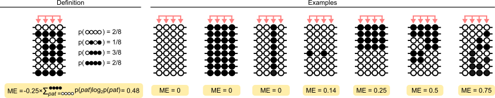

# Calculating methylation entropy

The `modkit entropy` command will calculate the methylation entropy in genomic windows of defined length across the genome, optionally summarizing these calculations for regions.
Methylation entropy (ME) is a measure of the "information content" in the patterns of methylation reported by the sequencing reads, it could also be thought of as a measure of the randomness in the epialleles (an "epiallele" is the DNA modification at a given position).
This metric was originally proposed by [Xie et al.](https://academic.oup.com/nar/article/39/10/4099/1303103#82681132) and has been shown to correlation with [regulation](https://academic.oup.com/nar/article/51/5/2046/7033790), [aging](https://genomebiology.biomedcentral.com/articles/10.1186/s13059-023-02866-4), and [cancer](https://journals.sagepub.com/doi/full/10.1177/1176935119828776).
Unlike the `pileup` method in `modkit` which aggregates the modification calls per genomic position, `modkit entropy` looks at the co-occurrence of methylation status on individual reads and so the input is a modBAM not a pileup.
To quote [Lee et al.](https://doi.org/10.1371/journal.pcbi.1010946), "This information is important because such ‘phased’ methylation states can inform us about the epigenetic diversity of cell populations as well as the local regulation states of the epigenome".
Probably the simplest visual description of methylation entropy is the following, a version of which appears in many of the methods papers:

<div style="text-align: center;">



</div>

Citation: [Lee et al.](https://github.com/dohlee/metheor/blob/master/img/me.png)

## Calculate entropy in windows across the genome

```bash
modkit entropy --in-bam ${mod_bam} \
 -o ${output_entropy_bedgraph} \
 --ref ${ref} \
 --threads 32 \
 --log-filepath modkit_entropy.log
```

When the output file, `-o`, is omitted the output will be to stdout. 

### Output schema

| column | name      | description          | type   |
|--------|-----------|----------------------|--------|
| 1      | chrom     | contig name          | string |
| 2      | start     | start of interval    | int    |
| 3      | end       | end of interval      | int    |
| 4      | entropy   | methylation entropy  | float  |
| 5      | num_reads | number of reads used | int    |


## Calculating entropy in BED-specified regions

The command can also summarize the methylation entropy in regions by using the `--regions` option, for example:

```bash
modkit entropy \
 --in-bam ${mod_bam} \
 -o ${output_directory} \
 --regions ${regions_bed_file} \  # BED3 or BED4 file of regions
 --cpg \  # specify CpG dinucleotides and combine strands
 --ref ${ref} \
 --threads 32 \
 --log-filepath modkit_entropy.log
```

The output must now be a directory (specified with `-o`), a bedGraph with the entropy over the windows with the regions as well as a summary of the methylation entropy in the regions will be output.
By default these files will be `regions.bed` and `windows.bedgraph`.

The schema for the `regions.bed` file is below:

| col | Name                    | Description                                                              | type  |
|-----|-------------------------|--------------------------------------------------------------------------|-------|
| 1   | chrom                   | chromosome of the region                                                 | str   |
| 2   | start                   | 0-based start position of the region                                     | int   |
| 3   | end                     | 0-based end position of the region                                       | int   |
| 4   | region_name             | name of the region from the input BED file                               | str   |
| 5   | mean_entropy            | average entropy of the passing windows included in the region            | float |
| 6   | strand                  | strand of the region {`+`, `-`, `.` }                                    | str   |
| 7   | median_entropy          | median entropy of the passing windows included in the region             | float |
| 8   | min_entropy             | minimum passing window entropy                                           | float |
| 9   | max_entropy             | maximum passing window entropy                                           | float |
| 10  | mean_num_reads          | average number of reads used in the passing windows' entropy calculation | float |
| 11  | min_num_reads           | minimum number of reads used in the passing windows' entropy calculation | int   |
| 12  | max_num_reads           | minimum number of reads used in the passing windows' entropy calculation | int   |
| 13  | successful_window_count | number of passing windows in the region                                  | int   |
| 14  | failed_window_count     | number of failed windows in the region                                   | int   |


## Specifying motifs or primary sequence bases

Similar to `pileup` you can specify a motif on the command line with `--motif` and optionally combine the counts across the positive and negative strands with `--combine-strands`.
If you specify a primary sequence base (with `--base`) or a motif (with `--motif`) that is not reverse-complement palindromic `modkit` will output methylation entropy per-strand.
This option can be passed multiple times to use multiple motifs.
When motifs specify different primary sequence bases, for example `--motif GATC 1` and `--motif CCGG 0`, all of the base modification statuses will be used in calculating the entropy values.


For example if you want to calculate m6A entropy in DRACH motifs:

```bash
${modkit} entropy ${bam} \
  -o ${output} \
  --regions ${regions} \
  --ref ${ref} \
  --motif DRACH 2 \
  --threads 32 \
  --log-filepath modkit_entropy.log \
```
When performing transcriptome analysis, it's recommended to make a regions BED file of all of the transcripts so that you can rank which transcripts have highest entropy.


## Calculation of methylation entropy

The calculation of methylation entropy has been described in the papers linked above. Formally, methylation entropy in `modkit` is calculated as:

\\[ 
\text{ME} = \frac{-1}{N} \sum_{\textbf{N}} Pr(n_i) * \text{log}_{2}Pr(n_i)
\\]

Where \\( \textbf{N} \\) is the set of all methylation patterns and \\( Pr(n_i) \\) is the empirical probability of that pattern.
To account for the fact that modkit [filters](./filtering_numeric_details.md) base modification calls when they are below a certain confidence level, filtered positions are given a "wildcard" assignment and can match any epiallele at that position.
The entropy calculation implementation in `modkit` will assign a fractional count to each pattern that the read matches.
For example, suppose a read with epiallele `m*mm` meaning there are 4 positions in the window (5mC) and this read reports 5mC, followed by a filtered call, and 2 more 5mC calls.
This read will match to patterns `[mhmm mmmm mCmm]` (`m` = 5mC, `h` = 5hmC, and `C` is canonical cytosine).
When the `--num-positions` parameter gets large the number of potential patterns becomes large.
Most patterns will probably not have any reads matching to them, so instead of enumerating all possible patterns modkit uses a prefix trie to find all patterns represented in the reads while accounting for filtered positions.
