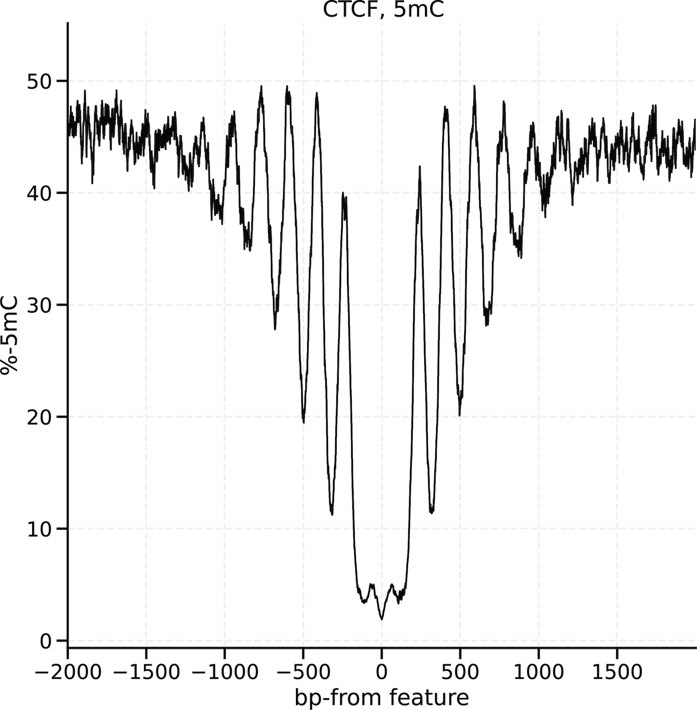

# Investigating patterns with localise

One a bedMethyl table has been created, `modkit localise` will use the pileup and calculate per-base modification aggregate information around genomic features of interest.
For example, we can investigate base modification patterns around CTCF binding sites.

<p align="center">
  
</p>

The input requirements to `modkit localise` are simple: 
1. BedMethyl table that has been bgzf-compressed and tabix-indexed
1. Regions file in BED format (plaintext).
1. Genome sizes tab-separated file: `<chrom>\t<size_in_bp>`

an example command:

```bash
modkit localise ${bedmethyl} --regions ${ctcf} --genome-sizes ${sizes}
```

The output table has the following schema:

| column | Name             | Description                                                                                                                                                                               | type  |
|--------|------------------|-------------------------------------------------------------------------------------------------------------------------------------------------------------------------------------------|-------|
| 1      | mod code         | modification code as present in the bedmethyl                                                                                                                                             | str   |
| 2      | offset           | bedMethyl position minus the original feature midpoint; negative is toward lower reference coordinates and positive toward higher coordinates, independent of the BED feature strand      | int   |
| 3      | n_valid          | number of valid calls at this offset for this modification code                                                                                                                           | int   |
| 4      | n_mod            | number of calls for this modification code at this offset                                                                                                                                 | int   |
| 5      | percent_modified | `n_mod` / `n_valid`  * 100                                                                                                                                                                | float |

Earlier modkit releases reported the opposite offset sign. Negate offsets from
those releases before comparing them with new output. The reference-coordinate
axis is not reversed for negative-strand features.

Optionally the `--chart` argument can be used to create HTML charts of the modification patterns.
