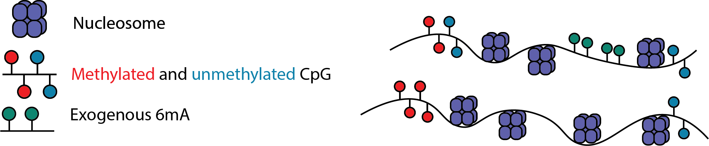

# Find regions of accessible chromatin

Nanopore sequencing can detect multiple base modifications simultaneously and we can leverage this capability by introducing exogenous base modifications at specific functional regions.
One such method uses a 6mA methyltransferase such as EcoGII or Hia5 to label accessible regions of chromatinized DNA, usually by treatment of cell nuclei with the enzyme.



## Predict regions of open chromatin
Modkit comes with a machine learning model that has been trained to identify regions of open chromatin based on 6mA signal.
You can invoke this model with the following command:

```bash
$ modkit open-chromatin predict ${mod_bam} \
    --model ${model} \
    --log modkit_predict.log \
    -o ./accessible_regions.bedgraph \
    --device 0
```

Where `${model}` is the path to the directory with the model, for example `dist_modkit_v0.5.0_38fda16/models/r1041_e82_400bps_hac_v5.2.0@v0.1.0`.
The output of the command is a bedGraph file with the following schema:

| column | name | description | type |
|--------|------|-------------|------|
| 1 | chrom | contig or scaffold | string |
| 2 | start | start of the region | int |
| 3 | end | end of the region | int |
| 4 | probability | accessibility probability, (0.0, 1) | float |

## Configuring `--step-size`

The open chromatin model in Modkit works by making predictions on 100 base pair windows of the genome.
The output of the model is a prediction _probability_ between 0.0 and 1.0, non-inclusive.
To make predictions on the whole genome (or regions when the `--include-bed` option is provided) Modkit applies the model to overlapping windows.
The `--step-size` determines how much to advance before making another prediction:

```text
Genome    <--//------------------//->
Window 1       |---w----|
Window 2       |_s_|---w----|
```
In the above `w` is the window size (100bp with the current model) and `s` is the step size which can be configured via the `--step-size` parameter.
The smaller the step size, the finer-graned resolution the output at the cost of more computation.
This can be seen in the following example browser image:


Step size of 25 base pairs is the default. 

## Using `--threshold` to get regions of high confidence

As seen above, the output from `ope-chromatin predict` is a stream of probabilities over the genome or desired region of the genome.
A lot of these predictions are going to be very close to zero.
You can remove low-probability regions with the `--threshold` option so that only intervals with a probability greater than or equal to this value are reported.
Using this option in combination with `bedtools merge` can transform the bedGraph file into a BED of predicted open chromatin regions.

```bash
$ modkit open-chromatin predict ${bam} \
  --model ${model} \
  --threshold 0.8 \
  --include-bed promoters_slop2000.bed \
  -o stdout \
  | bedtools merge -i - > accessible_regions.bed
```

## Running with a GPU

Modkit comes distributed with the capability to run open chromatin prediction on a normal CPU, NVIDIA GPUs, and can be built to run on Apple GPUs. 
The normal distribution only has the capability to run on CPU hardware.
At the current stage of development this configuration is probably too slow for most practical purposes outside of small region checks.
The `candle` distribution can be downloaded and used with NVIDIA GPUs directly, however we cannot guarantee that it will work on _every_ GPU setup. 
For the best performance on GPU _or_ CPU, the `tch` (pytorch) distribution is recommended, however it requires that you download libtorch from the internet.
Instructions can be found in the `BUILD_NOTES_*.txt` packaged with the software.

## Troubleshooting: Checking your input data

To predict regions of open chromatin, the input modBAM should have 6mA base modification calls.
You can quickly check that you have valid 6mA calls using the [`check-tags` command](./intro_modbam_check_tags.md):

```bash
$ modkit modbam check-tags ${bam} --head 1000
```

This command will return non-zero when you have invalid MM/ML [SAMTags](https://samtools.github.io/hts-specs/SAMtags.pdf).
You should expect to see an output similar to this:

```text
> checking tags on first 1000 reads
> no errors
> num PASS records: 1000 (100.00%)
> num records: 1000
> valid record tag headers:
+------------+-------+
| tag_header | count |
+------------+-------+
| A+a.       | 1000  |
+------------+-------+


> modified bases:
+--------+--------------+----------+------+
| strand | primary_base | mod_code | mode |
+--------+--------------+----------+------+
| +      | A            | a        | .    |
+--------+--------------+----------+------+
```


